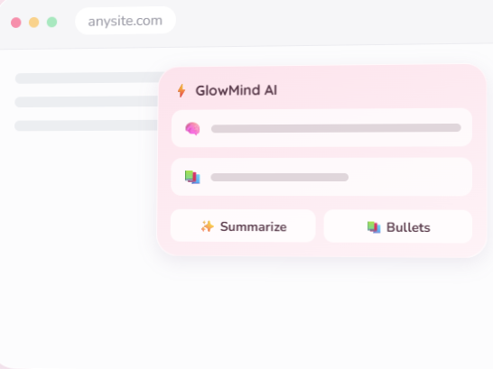
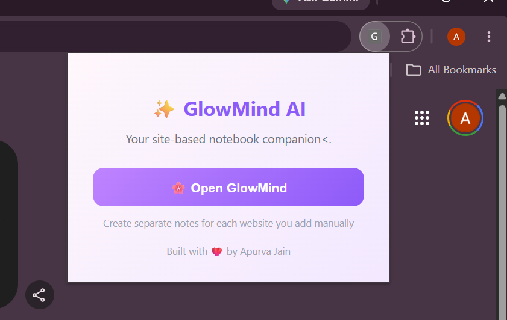

# 🌸 GlowMind AI — AI-Powered MERN Notes Workspace


GlowMind AI is a full-stack MERN application that combines intelligent note-taking, secure authentication, and a calming productivity-focused user experience. Built using MongoDB, Express.js, React, and Node.js, the platform allows users to securely create, manage, and organize notes in a modern glassmorphism-inspired workspace.

The application features JWT-based authentication, Google OAuth integration, MongoDB Atlas cloud storage, responsive design, and an AI-ready architecture for future integration with LLMs such as OpenAI GPT and Google Gemini.

## 🚀 Live Deployment

### Frontend

https://glowmind-mkql.vercel.app/

### Backend API

https://glowmind.onrender.com/

---

## ✨ Features

* 🔐 Secure Authentication (JWT + Google OAuth)
* 📝 Personal Note Management
* 🎨 Glassmorphism & Pastel-Themed UI
* 📱 Fully Responsive Design
* ⚡ Fast React + Vite Frontend
* 🔄 REST API with Express.js
* 🤖 AI-Ready Architecture for Future LLM Integration

---
## 🧩 Chrome Extension Preview



GlowMind AI also comes as a Chrome Extension that lets users quickly create AI-powered notes while browsing.

## 🧩 How to Install Chrome Extension

1. Clone or download the repository
2. Open Chrome and go to :chrome://extensions/

3. Enable **Developer Mode** (top right corner)
4. Click **Load Unpacked**
5. Navigate to the folder: GlowMind Extension/
6. Select the folder and load it
7. Pin the extension to your toolbar ✨


## 🛠️ Tech Stack

### Frontend

* React.js
* Vite
* React Router DOM
* Context API
* CSS3

### Backend

* Node.js
* Express.js
* JWT Authentication
* Google OAuth
* Express Validator
* Bcrypt.js

### Database

* MongoDB Atlas
* Mongoose ODM

### Deployment & Cloud

* Vercel (Frontend Hosting)
* Render (Backend Hosting)
* MongoDB Atlas (Database Hosting)

---

## 📂 Project Structure

```text
glowmind-ai/
├── src/
│   ├── pages/
│   ├── auth/
│   ├── components/
│   ├── hooks/
│   ├── utils/
│   └── styles/
│
├── server/
│   ├── middleware/
│   ├── models/
│   ├── routes/
│   ├── db.js
│   └── index.js
│
└── README.md
```

---


## 👩‍💻 Author

**Apurva Jain**

GitHub: https://github.com/APURVA122

LinkedIn: https://www.linkedin.com/in/apurva-jain-9462a7330/

---

⭐ If you found this project interesting, consider giving it a star on GitHub.
